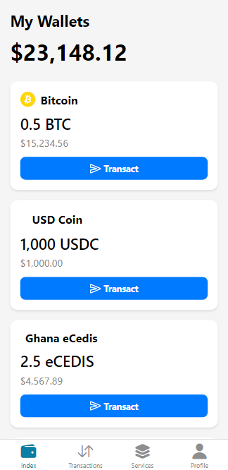

# Kdx. A TBDex Wallet Project

  <!-- Replace with the actual path to your logo image -->

## Overview
Kdx is a decentralized application designed to facilitate seamless interactions between users and Payment Financial Institutions (PFIs). The application leverages decentralized identifiers (DIDs) and verifiable credentials (VCs) to enhance user privacy and security while tracking customer satisfaction with various PFIs.

## Kdx main features
### Wallet Screen  & Service Screen
     


## Features
- **Decentralized Identity Management**: Users can create and manage their DIDs and VCs securely.
- **Customer Feedback System**: Collect and analyze user feedback on PFIs to improve service quality.
- **Real-Time Satisfaction Tracking**: Users can provide instant feedback after interactions with PFIs.
- **Data Privacy**: Implement privacy-preserving techniques to protect user identities while collecting valuable insights.

## Technologies Used
- **React Native Expo**: For building the mobile application.
- **TBDEX Protocol**: For decentralized storage and identity management.
- **IPFS**: For secure and decentralized feedback data storage.

## Getting Started

### Prerequisites
- Node.js (version 18 or higher)
- Expo Go or Android Emulator / iOS Simulator to view the app on visual or physical device
- Can also view the mobile app in a browser when you run it 


### Installation
1. Clone the repository:
   ```bash
   git clone https://github.com/YawManuel/KdxWallet
   ```

### Running the Application
- For the frontend (RN Expo):
  cd KApp and read it README.md file on how to run it
 
- For the backend (PFIs servers):
  cd kBackn and read it README.md file on how to run it

## License
This project is licensed under the MIT License. See the [LICENSE](LICENSE) file for details.

## Contact
For questions or feedback, please reach out to [ehadzah@gmai.com](mailto:your.email@example.com).
